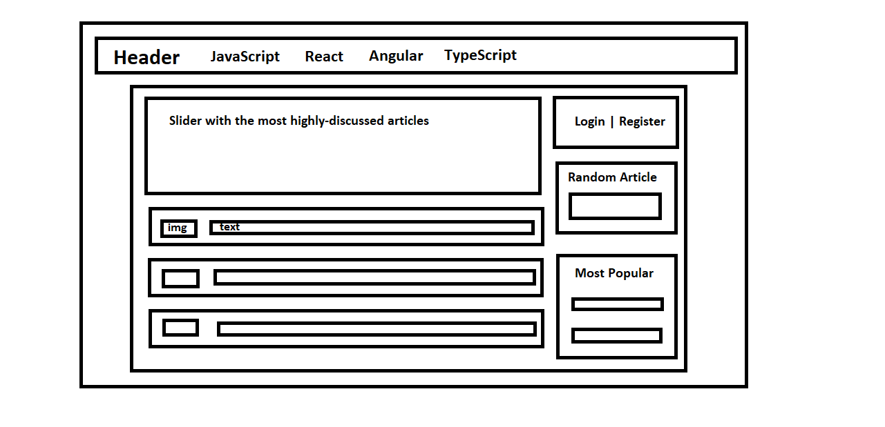

This will be a blog site with that focuses on social interactions between users. There will be 3 types of users:

1. Admin: the main administrator of the site. Can change the roles of other users, assign editors, add new and delete old articles, leave comments. Also can ban users (maybe?). At the beginning there will be 2 admins. 
2. Editor: can add and edit articles, leave comments and delete inappropriate comments of other people. 
3. Users: can browse articles, leave comments.

The model of the front page of the site should look like this:

Each article has:
- articleId
- authorId (index - userId)
- title
- categoryId (index)
- publicationDate
- tags
- content
- previewText
- previewImage
- headImage
- comments (this filed will be added with an sql query based on article id)
- views

Categories include:
- categoryId
- categoryName

Comments:
- commentId
- articleId (index)
- authorId (index - userId)
- content
- commentDate
- likes
- dislikes

Users:
- userId
- firstName
- lastName
- username
- password
- email
- roleId (index)
- isBanned (banned users cannot leave comments?)
- isOnline
- registrationDate

Roles:
- roleId
- roleName (Admin, Editor, User)